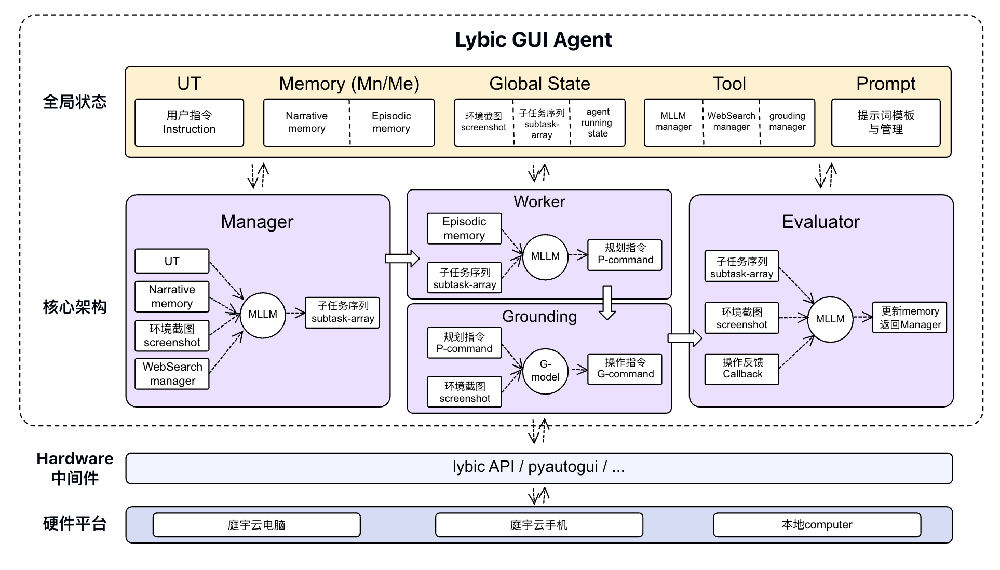

<div align="center">

**[English](./README.md) | [中文](./README-zh.md) | [日本語](./README-jp.md)**

<br/>
</div>

<p align="center">
  
</p>
<h1>
  <br/>
  Lybic GUI Agent: <small>コンピューター利用エージェントのためのオープンソースのエージェントフレームワーク</small> 
</h1>

<p align="center">
    <small>対象:</small>
    
    
    
    <br/>
    <small>バージョン:</small><a href="https://pypi.org/project/lybic-guiagents/"></a>
    &nbsp;
    <a href="https://github.com/lybic/agent/blob/main/LICENSE"></a>
    &nbsp;
    <a href="https://github.com/lybic/agent"></a>
</p>

## Lybic GUI Agentとは?

Lybicプラットフォームプレースホルダー - インテリジェントエージェントを構築および展開するための包括的なAIプラットフォーム

Lybic GUI Agentは、開発者や企業がインテリジェントなコンピューター利用エージェント、モバイル利用エージェント、およびWindows、macOS、Linux、Android（lybic Android Sandbox経由）プラットフォーム上のグラフィカルユーザーインターフェースを理解し、操作できるインテリジェントエージェントを作成できるようにするオープンソースフレームワークです。

<!-- <p align="center"><small>Lybic GUI Agentは<a href="https://github.com/simular-ai/Agent-S">Agent-S</a>のコードベースに基づいており、これにより、使い慣れた実行ロジックを維持しながら、Lybicとの最高のインタラクション体験の作成に集中できます。</small></p> -->

<div align="center">

<p>セットアップをスキップしますか？数回クリックするだけで、<a href="https://playground.lybic.cn/">プレイグラウンド</a>でLybic GUI Agentをお試しください。（中国本土でのみサポートされています）

</div>

## 🥳 更新情報
- [x] **2025/09/14**: この論文は現在[arxiv](https://arxiv.org/abs/2509.11067)で公開されている。
- [x] **2025/09/09**: [OS-world](https://os-world.github.io/)の50ステップ長で世界第1位を達成しました！
- [x] **2025/08/08**: Windows、Mac、Ubuntu、Lybic APIをサポートする[Lybic GUI Agent](https://github.com/lybic/agent)ライブラリのv0.1.0をリリースしました！

## 目次

1. [💡 はじめに](#-はじめに)
2. [🛠️ インストールとセットアップ](#️-インストールとセットアップ) 
3. [🚀 使い方](#-使い方)
4. [💬 Citations](#-citations)

## 💡 はじめに

## ✨ 機能的なLybicサポート

- **複数のLLMプロバイダー**: OpenAI, Anthropic, Google, xAI , AzureOpenAI, DeepSeek, Qwen, Doubao, ZhipuGLM
  - **集約モデルプロバイダー**: Bedrock, Groq, Monica, OpenRouter, SiliconFlow
- **RAG**: RAGをサポートしており、この機能は拡張機能として提供されます
- **クロスプラットフォームGUIコントロール**: Windows, Linux, macOS, Androidをサポート
- **可観測性**: サポート済み
- **ローカル展開**: サポート済み
- **クラウドサンドボックス環境**: サポート済み

<p align="center">🎉 エージェントオンラインデモ</p>

[](https://www.youtube.com/watch?v=GaOoYoRKWhE)

<p align="center">🎯 現在の結果</p>

<div align="center">
  <table border="0" cellspacing="0" cellpadding="5">
    <tr>
      <th>ベンチマーク</th>
      <th>Lybic GUI Agent</th>
      <th>以前のSOTA</th>
    </tr>
    <tr>
      <td>OSWorld Verified (50 step)</td>
      <td><b>57.1%</b></td>
      <td>53.1%</td>
    </tr>
  </table>
</div>

<p align="center">
  
</p>
<p align="center"><b>図 Lybic GUI Agentシステム構成</b></p>

## 🛠️ インストールとセットアップ

> [!WARNING]
> Lybic GUI Agentの可能性を最大限に活用するために、OpenAI、Anthropic、Gemini、Doubaoなど、複数のモデルプロバイダーをサポートしています。最高のビジュアルグラウンディングパフォーマンスを得るには、UI-TARSモデルを使用することをお勧めします。

### インストール

インストールには[UV](https://docs.astral.sh/uv/getting-started/installation/)（最新のPythonパッケージマネージャー）バージョン0.8.5を使用できます。

```bash
# 1. UVがまだインストールされていない場合はインストールします
# macOSおよびLinux
curl -LsSf https://astral.sh/uv/0.8.5/install.sh | sh
# Windows
powershell -ExecutionPolicy ByPass -c "irm https://astral.sh/uv/0.8.5/install.ps1 | iex"

# uvのインストールをテストします。バージョンは0.8.5である必要があります
uv --version

# 2. python 3.12をインストールします
uv python install 3.12.11

# 3. 仮想環境を作成します
uv venv -p 3.12.11

# 4. 仮想環境をアクティブにします
# macOSおよびLinux
source .venv/bin/activate
# Windows
.venv\Scripts\activate

# 5. 依存関係をインストールします（ロックされたバージョンを使用）
uv sync

# 6. パッケージを開発モードでローカルにインストールします
uv pip install -e .
```

### APIキーの設定

APIキーを設定する最も簡単な方法は次のとおりです。

1. `gui_agents/.env.example`を`gui_agents/.env`にコピーします
2. `.env`ファイルを編集してAPIキーを追加します

### ツール設定

2つの事前設定済みツール設定を提供しています。

- `tools_config_en.json`: 英語モデル（Gemini、Exa）用に設定
- `tools_config_cn.json`: 中国語モデル（Doubao、bocha）用に設定

エージェントはデフォルトで`tools_config.json`を使用します。次のことができます。

- `tools_config_en.json`または`tools_config_cn.json`のいずれかを`tools_config.json`にコピーします
- または、独自のカスタム設定を作成します

`tools_config_cn.json`を使用して`pyautogui`バックエンドを使用している場合、環境変数`ARK_API_KEY`のみを設定する必要があります。

`tools_config_en.json`を使用して`pyautogui`バックエンドを使用している場合は、次の3つの環境変数を設定する必要があります。

```bash
GEMINI_ENDPOINT_URL=https://generativelanguage.googleapis.com/v1beta/openai/
GEMINI_API_KEY=your_gemini_api_key
ARK_API_KEY=your_ark_api_key
```

```bash
# 英語モデルの場合
cp gui_agents/tools/tools_config_en.json gui_agents/tools/tools_config.json

# 中国語モデルの場合
cp gui_agents/tools/tools_config_cn.json gui_agents/tools/tools_config.json
```

> **注**: 推奨構成では、`"tool_name": "grounding"`または`"fast_action_generator"`に`doubao-1-5-ui-tars-250428`を使用し、`"tool_name": "action_generator"`などの他のツールには`claude-sonnet-4-20250514`または`doubao-seed-1-6-250615`を使用します。ツール構成ファイルでモデル構成をカスタマイズできます。`tools_config.json`ファイルの`"tool_name"`は変更しないでください。`tools_config.json`ファイルの`"provider"`と`"model_name"`を変更するには、[model.md](gui_agents/tools/model.md)を参照してください。

## 🚀 使い方

### コマンドラインインターフェース

コマンドラインインターフェースでpythonを使用してLybic GUI Agentを実行します。

```sh
python gui_agents/cli_app.py [OPTIONS]
```

これにより、指示を入力してエージェントと対話できるユーザープロンプトが表示されます。

### オプション

- `--backend [lybic|pyautogui|pyautogui_vmware]`: GUIを制御するために使用するバックエンドを指定します。デフォルトは`lybic`です。

- `--query "YOUR_QUERY"`: オプション。実行時に入力できます。指定した場合、エージェントはクエリを実行して終了します。
- `--max-steps NUMBER`: エージェントが実行できる最大ステップ数を設定します。デフォルトは`50`です。
- `--mode [normal|fast]`: （オプション）エージェントモードを選択します。`normal`は詳細な推論とメモリを備えた完全なエージェントを実行し、`fast`モードは推論のオーバーヘッドを少なくしてアクションをより迅速に実行します。デフォルトは`normal`です。
- `--enable-takeover`: （オプション）ユーザーの引き継ぎ機能を有効にし、エージェントが必要なときに一時停止してユーザーの介入を要求できるようにします。デフォルトでは、ユーザーの引き継ぎは無効になっています。
- `--disable-search`: （オプション）Web検索機能を無効にします。デフォルトでは、Web検索は有効になっています。

### 例

`lybic`バックエンドを使用してインタラクティブモードで実行します。
```sh
python gui_agents/cli_app.py --backend lybic
```

`pyautogui`バックエンドと最大20ステップで単一のクエリを実行します。
```sh
python gui_agents/cli_app.py --backend pyautogui --query "電卓で8×7の結果を求めよ" --max-steps 20
```

`pyautogui`バックエンドを使用して高速モードで実行します。
```sh
python gui_agents/cli_app.py --backend pyautogui --mode fast
```

> [!WARNING]
> エージェントは`--backend pyautogui`でコンピューターを直接制御します。注意して使用してください。

### Lybicサンドボックスの設定

Lybicサンドボックスを設定する最も簡単な方法は、[APIキーの設定](#apiキーの設定)セクションで説明したように、`.env`ファイルを編集してAPIキーを追加することです。


```bash
LYBIC_API_KEY=your_lybic_api_key
LYBIC_ORG_ID=your_lybic_org_id
LYBIC_MAX_LIFE_SECONDS=3600
```

> **注**: [Lybicダッシュボード](https://dashboard.lybic.cn/)で事前に作成されたLybicサンドボックスを使用する場合は、`LYBIC_PRECREATE_SID`を事前に作成されたサンドボックスIDに設定する必要があります。

> 
> ```bash
> LYBIC_PRECREATE_SID=SBX-XXXXXXXXXXXXXXX
> ```

### VMwareの設定

PyAutoGUIをVMwareで使用するには、[VMware Workstation Pro](https://www.vmware.com/products/desktop-hypervisor/workstation-and-fusion)（Windowsの場合）をインストールし、仮想マシンを作成する必要があります。

次に、Hugging Faceから[`Windows-x86.zip`](https://huggingface.co/datasets/xlangai/ubuntu_osworld/resolve/main/Ubuntu-x86.zip)と[`Ubuntu-x86.zip`](https://huggingface.co/datasets/xlangai/ubuntu_osworld/resolve/main/Ubuntu-x86.zip)をダウンロードする必要があります。次に、それらを`./vmware_vm_data/Windows-x86`および`./vmware_vm_data/Ubuntu-x86`ディレクトリに解凍します。

最後に、`.env`ファイルを編集し、`USE_PRECREATE_VM`環境変数を仮想マシンの名前に設定する必要があります。`USE_PRECREATE_VM`は、x86アーキテクチャコンピューターで`Windows`と`Ubuntu`をサポートします。

```bash
USE_PRECREATE_VM=Ubuntu
```

## 🔧 トラブルシューティング

### 一般的なランタイムの問題

#### 1. APIキーの設定の問題

**問題**: エージェント実行時の`KeyError`または認証エラー。

**解決策**:
- `.env`ファイルが有効なAPIキーで正しく設定されていることを確認します
- 環境変数が正しく設定されていることを確認します。
  ```bash
  # 英語モデルの場合
  export GEMINI_API_KEY=your_gemini_api_key
  export ARK_API_KEY=your_ark_api_key
  
  # 中国語モデルの場合  
  export ARK_API_KEY=your_ark_api_key
  ```
- APIキーの権限とクォータを確認します

#### 2. Python環境の問題

**問題**: `ModuleNotFoundError`またはパッケージのインポートエラー。

**解決策**:
- 指定どおりにPython 3.12.11を使用していることを確認します
- 仮想環境をアクティブにします。
  ```bash
  # macOS/Linux
  source .venv/bin/activate
  # Windows
  .venv\Scripts\activate
  ```
- 依存関係を再インストールします。
  ```bash
  uv sync
  uv pip install -e .
  ```

#### 3. Lybicサンドボックス接続の問題

**問題**: `Connection timeout`または`Sandbox creation failed`。

**解決策**:
- Lybicサーバーへのネットワーク接続を確認します
- `LYBIC_ORG_ID`と`LYBIC_API_KEY`が正しいことを確認します
- Lybicアカウントに十分なクォータがあることを確認します
- サンドボックスがタイムアウトする場合は、`LYBIC_MAX_LIFE_SECONDS`を増やしてみてください

#### 4. VMwareバックエンドの問題

**問題**: 仮想マシンが起動または制御に失敗する。

**解決策**:
- VMware Workstation Proが正しくインストールされていることを確認します
- VMファイルが正しいディレクトリに解凍されていることを確認します。
  - `./vmware_vm_data/Windows-x86/`
  - `./vmware_vm_data/Ubuntu-x86/`
- VMwareサービスが実行されていることを確認します
- 正しい`USE_PRECREATE_VM`環境変数を設定します

#### 5. モデルのパフォーマンスの問題

**問題**: 応答時間が遅い、またはグラウンディングの精度が低い。

**解決策**:

- パフォーマンスを向上させるために、推奨モデルを使用します。
  - ビジュアルグラウンディング: `doubao-1-5-ui-tars-250428`
  - アクション生成: `claude-sonnet-4-20250514`
- より迅速な実行のために`--mode fast`に切り替えます
- 短いタスクの場合は`--max-steps`を減らします

### ヘルプの入手

ここで説明されていない問題が発生した場合:

1. 同様の問題について[GitHub Issues](https://github.com/lybic/agent/issues)を確認します
2. [Lybicドキュメント](https://lybic.ai/docs)を確認します
3. 次の内容で新しいイシューを作成します。
   - オペレーティングシステムとバージョン
   - Pythonのバージョンと環境の詳細
   - 完全なエラーメッセージ
   - 問題を再現する手順
   - 
## 💬 Citations

```bibtex
@misc{guo2025agenticlybicmultiagentexecution,
      title={Agentic Lybic: Multi-Agent Execution System with Tiered Reasoning and Orchestration}, 
      author={Liangxuan Guo and Bin Zhu and Qingqian Tao and Kangning Liu and Xun Zhao and Xianzhe Qin and Jin Gao and Guangfu Hao},
      year={2025},
      eprint={2509.11067},
      archivePrefix={arXiv},
      primaryClass={cs.AI},
      url={https://arxiv.org/abs/2509.11067}, 
}
```

## Stargazers over time

[](https://starchart.cc/lybic/agent)

## ライセンス

このプロジェクトはApache 2.0ライセンスの下で配布されています。
したがって、ソースコードを変更して商用リリースすることができます。
