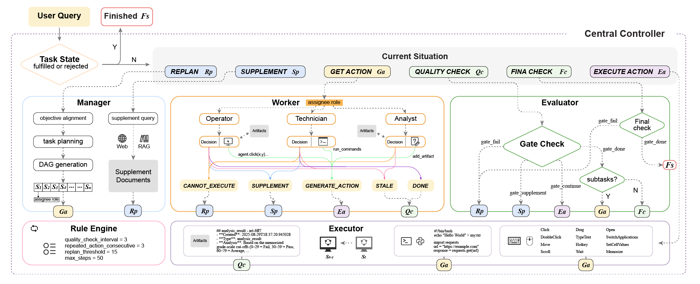
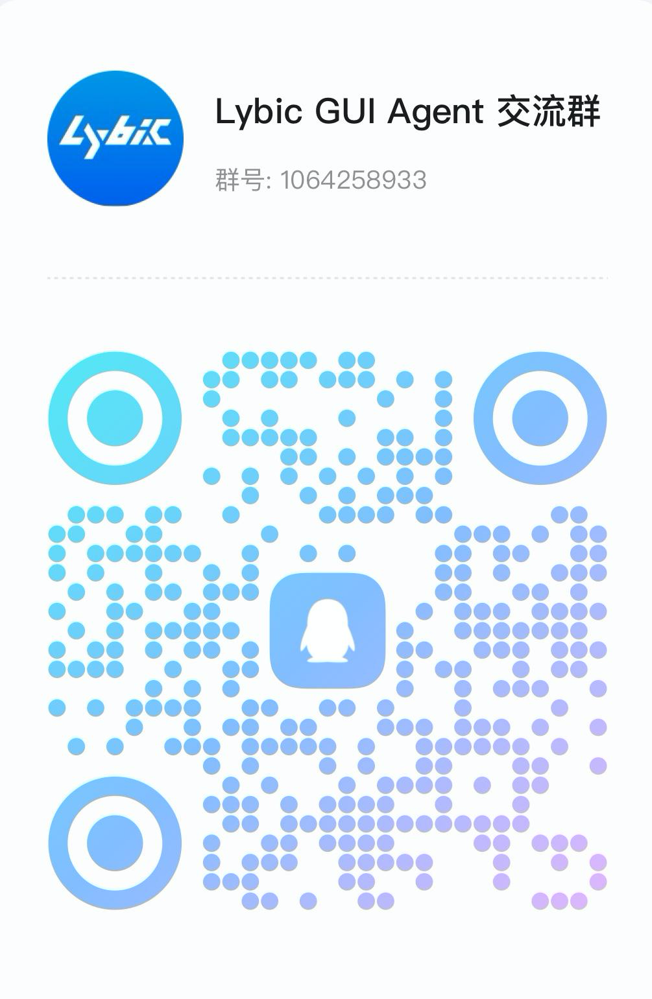

<div align="center">

**[English](./README.md) | [中文](./README-zh.md) | [日本語](./README-jp.md)**

<br/>
</div>

<p align="center">
  
</p>
<h1>
  <br/>
  Lybic GUI Agent: <small>一个用于计算机操作的开源智能体框架</small> 
</h1>

<p align="center">
    <small>支持的操作系统:</small>
    
    
    
    <br/>
    <small>版本:</small><a href="https://pypi.org/project/lybic-guiagents/"></a>
    &nbsp;
    <a href="https://github.com/lybic/agent/blob/main/LICENSE"></a>
    &nbsp;
    <a href="https://github.com/lybic/agent"></a>
</p>

## Lybic GUI Agent是什么?

Lybic平台 —— 一个用于构建和部署智能代理的综合性AI平台。

Lybic GUI Agent 是一个开源框架，使开发人员和企业能够创建能够理解并在Windows、macOS、Linux和Android（通过Lybic Android沙盒）等平台上与图形用户界面进行交互的智能计算机使用代理和移动设备使用代理。

<!-- <p align="center"><small>Lybic GUI Agent 基于 <a href="https://github.com/simular-ai/Agent-S">Agent-S</a> 代码库，这使我们能够专注于打造与Lybic的最佳交互体验，同时保持熟悉的执行逻辑。</small></p> -->

<div align="center">

<p>想要跳过安装步骤？只需点击几下，即可在我们的<a href="https://playground.lybic.cn/">在线Playground</a>中试用Lybic GUI Agent。（仅支持中国大陆地区）

</div>

## 🥳 最新动态
- [x] **2025/09/14**: 论文已经在[arxiv](https://arxiv.org/abs/2509.11067)上可以浏览
- [x] **2025/09/09**: 我们在[OS-world](https://os-world.github.io/) 50步任务中取得了世界第一的成绩！
- [x] **2025/08/08**: 发布了[Lybic GUI Agent](https://github.com/lybic/agent) v0.1.0版本，支持Windows、Mac、Ubuntu和Lybic API！

## 目录

1. [💡 介绍](#-介绍)
2. [🛠️ 安装与设置](#️-安装与设置) 
3. [🚀 使用方法](#-使用方法)
4. [🔧 问题排查](#-问题排查)
5. [💬 Citations](#-citations)

## 💡 介绍

## ✨ Lybic Agentic 功能支持

- **多LLM供应商支持**:  OpenAI, Anthropic, Google, xAI , AzureOpenAI, DeepSeek, Qwen, Doubao, ZhipuGLM
  - **聚合模型供应商**:  Bedrock, Groq, Monica, OpenRouter, SiliconFlow
- **RAG**: 我们支持RAG，该功能作为扩展提供
- **跨平台GUI控制**: 支持Windows, Linux, macOS, Android
- **可观测性**: 支持
- **本地部署**: 支持
- **云端沙盒环境**: 支持

<p align="center">🎉 智能体在线演示</p>

[](https://www.youtube.com/watch?v=GaOoYoRKWhE)

<p align="center">🎯 当前成果</p>

<div align="center">
  <table border="0" cellspacing="0" cellpadding="5">
    <tr>
      <th>基准测试</th>
      <th>Lybic GUI Agent</th>
      <th>先前SOTA</th>
    </tr>
    <tr>
      <td>OSWorld Verified (50步)</td>
      <td><b>57.1%</b></td>
      <td>53.1%</td>
    </tr>
  </table>
</div>

<p align="center">
  
</p>
<p align="center"><b>图. Lybic GUI Agent 系统架构</b></p>

## 🛠️ 安装与设置

> [!WARNING]
> 为了充分发挥Lybic GUI Agent的潜力，我们支持包括OpenAI、Anthropic、Gemini和Doubao在内的多家模型供应商。为获得最佳的视觉定位性能，我们建议使用UI-TARS模型。

### 安装(从PyPI安装)

在您的终端中运行以下命令：

```bash
pip install lybic-guiagents
```

### 安装(从源代码安装)

您可以使用 [UV](https://docs.astral.sh/uv/getting-started/installation/) (一个现代化的Python包管理器) 0.8.5版本进行安装：

```bash
# 1. 如果尚未安装UV，请先安装
# macOS 和 Linux
curl -LsSf https://astral.sh/uv/0.8.5/install.sh | sh
# Windows
powershell -ExecutionPolicy ByPass -c "irm https://astral.sh/uv/0.8.5/install.ps1 | iex"

# 测试uv安装，版本应为0.8.5
uv --version

# 2. 安装 python 3.14
uv python install 3.14

# 3. 创建虚拟环境
uv venv -p 3.14

# 4. 激活虚拟环境
# macOS 和 Linux
source .venv/bin/activate
# Windows
.venv\Scripts\activate

# 5. 安装依赖项（使用锁定版本）
uv sync

# 6. 在开发模式下本地安装包
uv pip install -e .
```

### API密钥配置

配置API密钥的最简单方法是：

1. 将 `gui_agents/.env.example` 复制为 `gui_agents/.env`
2. 编辑 `.env` 文件并添加您的API密钥

### 工具配置

我们提供两种预配置的工具设置：

- `tools_config_en.json`: 为英语语言模型（Gemini, Exa）配置
- `tools_config_cn.json`: 为中文语言模型（Doubao, bocha）配置

智能体默认使用 `tools_config.json`。您可以：

- 将 `tools_config_en.json` 或 `tools_config_cn.json` 复制为 `tools_config.json`
- 或者创建您自己的自定义配置

如果您使用 `tools_config_cn.json` 并使用 `pyautogui` 后端，则只需设置环境变量 `ARK_API_KEY`。

如果您使用 `tools_config_en.json` 并使用 `pyautogui` 后端，则应设置以下3个环境变量：

```bash
GEMINI_ENDPOINT_URL=https://generativelanguage.googleapis.com/v1beta/openai/
GEMINI_API_KEY=your_gemini_api_key
ARK_API_KEY=your_ark_api_key
```

```bash
# 对于英语模型
cp gui_agents/tools/tools_config_en.json gui_agents/tools/tools_config.json

# 对于中文模型
cp gui_agents/tools/tools_config_cn.json gui_agents/tools/tools_config.json
```

> **注意**: 我们的推荐配置为 `"tool_name": "grounding"` 或 `"fast_action_generator"` 使用 `doubao-1-5-ui-tars-250428`，为 `"tool_name": "action_generator"` 等其他工具使用 `claude-sonnet-4-20250514` 或 `doubao-seed-1-6-250615`。您可以在工具配置文件中自定义模型配置。请勿修改 `tools_config.json` 文件中的 `"tool_name"`。要更改 `tools_config.json` 文件中的 `"provider"` 和 `"model_name"`，请参阅 [model.md](gui_agents/tools/model.md)

## 🚀 使用方法

### 命令行界面

在命令行界面中使用python运行Lybic GUI Agent：

```sh
python gui_agents/cli_app.py [OPTIONS]
```

这将显示一个用户查询提示，您可以在其中输入指令并与智能体进行交互。

### 选项

- `--backend [lybic|pyautogui|pyautogui_vmware]`: 指定用于控制GUI的后端。默认为 `lybic`。

- `--query "YOUR_QUERY"`: 可选，可在运行时输入；如果提供，智能体将执行查询然后退出。
- `--max-steps NUMBER`: 设置智能体可以执行的最大步数。默认为 `50`。
- `--mode [normal|fast]`: (可选) 选择智能体模式。`normal` 模式运行完整的智能体，具有详细的推理和记忆，而 `fast` 模式以较少的推理开销更快地执行操作。默认为 `normal`。
- `--enable-takeover`: (可选) 启用用户接管功能，允许智能体在需要时暂停并请求用户干预。默认情况下，用户接管是禁用的。
- `--disable-search`: (可选) 禁用Web搜索功能。默认情况下，Web搜索是启用的。

### 示例

使用 `lybic` 后端以交互模式运行：
```sh
python gui_agents/cli_app.py --backend lybic
```

使用 `pyautogui` 后端和最多20个步骤运行单个查询：
```sh
python gui_agents/cli_app.py --backend pyautogui --query "在计算器上计算 8 × 7 的结果" --max-steps 20
```

使用 `pyautogui` 后端以快速模式运行：
```sh
python gui_agents/cli_app.py --backend pyautogui --mode fast
```

> [!WARNING]
> 使用 `--backend pyautogui` 时，智能体将直接控制您的计算机。请谨慎使用。

### Docker
您也可以使用Docker来运行Lybic GUI Agent。这是一个使用`lybic`后端的运行示例：
```sh
docker run --rm -it --env-file gui_agents/.env agenticlybic/guiagent --backend lybic
```
> **注意**: 此命令以交互模式启动智能体。`--env-file`标志指向环境文件，请确保路径正确。

### Lybic沙盒配置

配置Lybic沙盒的最简单方法仍然是编辑 `.env` 文件并添加您的API密钥，如[API密钥配置](#api密钥配置)部分所述。


```bash
LYBIC_API_KEY=your_lybic_api_key
LYBIC_ORG_ID=your_lybic_org_id
LYBIC_MAX_LIFE_SECONDS=3600
```

> **注意**: 如果您想使用在[Lybic仪表板](https://dashboard.lybic.cn/)中预创建的Lybic沙盒，您需要将 `LYBIC_PRECREATE_SID` 设置为预创建的沙盒ID。

> 
> ```bash
> LYBIC_PRECREATE_SID=SBX-XXXXXXXXXXXXXXX
> ```

### 以服务形式使用

您可以通过两种方式以编程方式与智能体交互：将其作为Python库导入，或将其作为gRPC服务运行。

#### 作为Python库

安装 `lybic-guiagents` 后，您可以直接在Python代码中导入和使用其组件。

主要组件:
- `AgentService`: 高层服务接口 (推荐大多数用户使用)。
- `AgentS2`, `AgentSFast`: 核心agent实现。
- `HardwareInterface`: 用于控制GUI的硬件抽象层。
- `ServiceConfig`: 配置管理器。

**快速开始:**

```python
from gui_agents import AgentService 
service = AgentService()
result = service.execute_task("Take a screenshot")
print(f"Task completed: {result.status}")
```

#### 作为gRPC服务

您还可以将智能体作为独立的gRPC服务运行，这对于分布式架构或与用其他语言编写的应用程序集成非常理想。

**1. 运行gRPC服务器**

首先，使用Docker运行gRPC服务器。此命令会覆盖默认的CLI入口点，并在50051端口上启动gRPC服务。

```sh
docker run --rm -it -p 50051:50051 --env-file gui_agents/.env agenticlybic/guiagent /app/.venv/bin/lybic-guiagent-grpc
```
> **注意**: `-p 50051:50051` 标志将容器的gRPC端口映射到您的主机。

**2. Python客户端示例**

服务运行后，您可以使用gRPC客户端与其交互。以下是一个Python示例，演示如何向智能体发送指令并流式传输其进度。

首先，确保您已安装必要的gRPC库并生成了protobuf存根：
```sh
# 安装gRPC工具
pip install grpcio grpcio-tools

# 从.proto文件生成存根
python -m grpc_tools.protoc -Igui_agents/proto --python_out=gui_agents/proto/pb --grpc_python_out=gui_agents/proto/pb --pyi_out=gui_agents/proto/pb gui_agents/proto/agent.proto
```

然后，您可以使用以下脚本与智能体通信：

```python
import asyncio
import grpc
from gui_agents.proto.pb import agent_pb2, agent_pb2_grpc

async def run_agent_instruction():
    # 连接到gRPC服务器
    async with grpc.aio.insecure_channel('localhost:50051') as channel:
        # 为Agent服务创建存根
        stub = agent_pb2_grpc.AgentStub(channel)

        # 创建一个运行指令的请求
        request = agent_pb2.RunAgentInstructionRequest(
            instruction="打开计算器并计算 1 + 1"
        )

        print(f"发送指令: '{request.instruction}'")

        # 调用RunAgentInstruction RPC并遍历响应流
        try:
            async for response in stub.RunAgentInstruction(request):
                print(f"[{response.stage}] {response.message}")
        except grpc.aio.AioRpcError as e:
            print(f"发生错误: {e.details()}")

if __name__ == '__main__':
    asyncio.run(run_agent_instruction())
```

### VMware配置

要将PyAutoGUI与VMware一起使用，您需要安装[VMware Workstation Pro](https://www.vmware.com/products/desktop-hypervisor/workstation-and-fusion)（在Windows上）并创建一个虚拟机。

接下来，您需要从Hugging Face下载[`Windows-x86.zip`](https://huggingface.co/datasets/xlangai/ubuntu_osworld/resolve/main/Ubuntu-x86.zip)和[`Ubuntu-x86.zip`](https://huggingface.co/datasets/xlangai/ubuntu_osworld/resolve/main/Ubuntu-x86.zip)。然后将它们解压缩到`./vmware_vm_data/Windows-x86`和`./vmware_vm_data/Ubuntu-x86`目录中。

最后，您需要编辑`.env`文件，并将`USE_PRECREATE_VM`环境变量设置为虚拟机的名称。`USE_PRECREATE_VM`在x86架构计算机上支持`Windows`和`Ubuntu`。

```bash
USE_PRECREATE_VM=Ubuntu
```

## 🔧 问题排查

### 常见运行时问题

#### 1. API密钥配置问题

**问题**: 运行智能体时出现`KeyError`或身份验证错误。

**解决方案**:
- 确保您的`.env`文件已使用有效的API密钥正确配置
- 检查环境变量是否设置正确：
  ```bash
  # 对于英语模型
  export GEMINI_API_KEY=your_gemini_api_key
  export ARK_API_KEY=your_ark_api_key
  
  # 对于中文模型  
  export ARK_API_KEY=your_ark_api_key
  ```
- 验证API密钥权限和配额

#### 2. Python环境问题

**问题**: `ModuleNotFoundError`或包导入错误。

**解决方案**:
- 确保您使用的是指定的Python >= 3.12
- 激活虚拟环境：
  ```bash
  # macOS/Linux
  source .venv/bin/activate
  # Windows
  .venv\Scripts\activate
  ```
- 重新安装依赖项：
  ```bash
  uv sync
  uv pip install -e .
  ```

#### 3. Lybic沙盒连接问题

**问题**: `Connection timeout`或`Sandbox creation failed`。

**解决方案**:
- 检查与Lybic服务器的网络连接
- 验证`LYBIC_ORG_ID`和`LYBIC_API_KEY`是否正确
- 确保您的Lybic账户中有足够的配额
- 如果沙盒超时，请尝试增加`LYBIC_MAX_LIFE_SECONDS`

#### 4. VMware后端问题

**问题**: 虚拟机无法启动或控制。

**解决方案**:
- 确保VMware Workstation Pro已正确安装
- 检查VM文件是否已解压缩到正确的目录：
  - `./vmware_vm_data/Windows-x86/`
  - `./vmware_vm_data/Ubuntu-x86/`
- 验证VMware服务是否正在运行
- 设置正确的`USE_PRECREATE_VM`环境变量

#### 5. 模型性能问题

**问题**: 响应时间慢或定位准确性差。

**解决方案**:

- 使用推荐的模型以获得更好的性能：
  - 视觉定位: `doubao-1-5-ui-tars-250428`
  - 动作生成: `claude-sonnet-4-20250514`
- 切换到`--mode fast`以加快执行速度
- 对于较短的任务，减少`--max-steps`

### 获取帮助

如果您遇到此处未涵盖的问题：

1. 在[GitHub Issues](https://github.com/lybic/agent/issues)中检查类似问题
2. 查看[Lybic文档](https://lybic.ai/docs)
3. 创建一个新issue，并提供：
   - 您的操作系统和版本
   - Python版本和环境详细信息
   - 完整的错误消息
   - 重现问题的步骤

## 💬 Citations

我们的论文引用：

```bibtex
@misc{guo2025agenticlybicmultiagentexecution,
      title={Agentic Lybic: Multi-Agent Execution System with Tiered Reasoning and Orchestration}, 
      author={Liangxuan Guo and Bin Zhu and Qingqian Tao and Kangning Liu and Xun Zhao and Xianzhe Qin and Jin Gao and Guangfu Hao},
      year={2025},
      eprint={2509.11067},
      archivePrefix={arXiv},
      primaryClass={cs.AI},
      url={https://arxiv.org/abs/2509.11067}, 
}
```
---

## ❤️ Touch us:

<div align="center" style="display: flex; justify-content: center; gap: 20px; flex-wrap: wrap;">
  
  
  
</div>

## Stargazers over time

[](https://starchart.cc/lybic/agent)

## 许可证

该项目根据Apache 2.0许可证分发。
因此，您可以修改源代码并进行商业发布。
